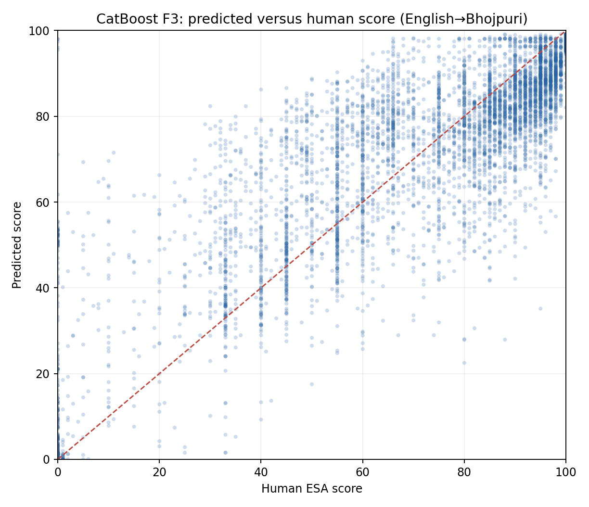
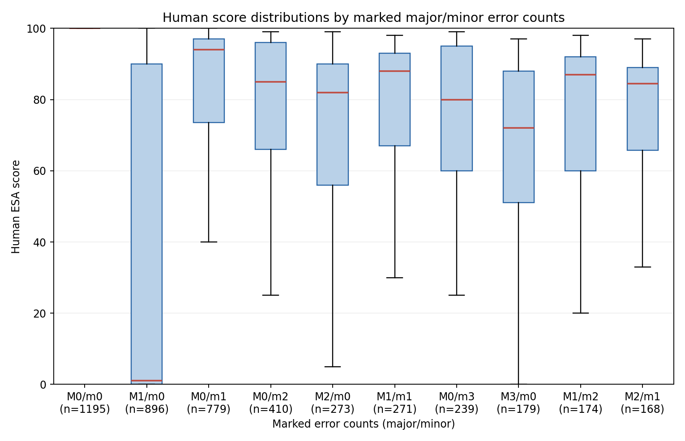
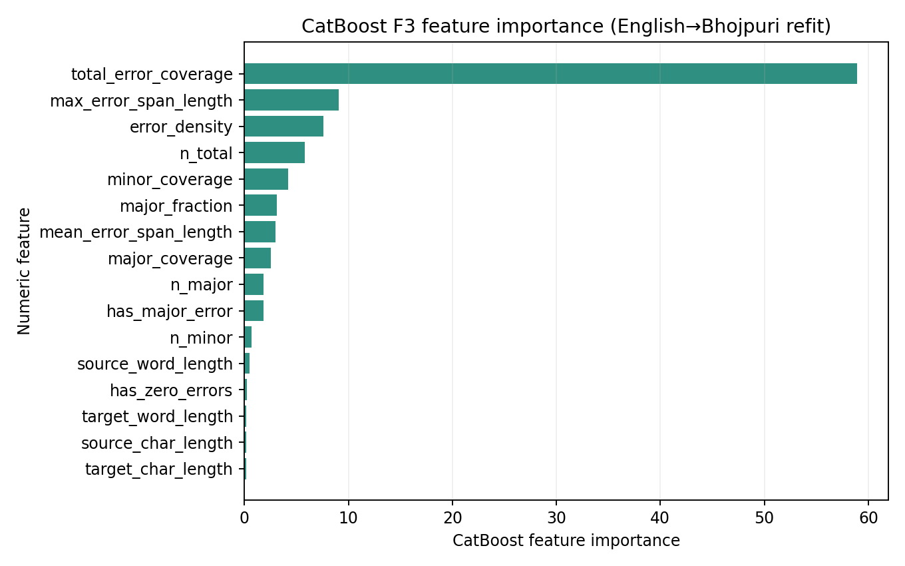

# WMT25 ESA score prediction from error annotations

## Objective and protocol

This CPU-only experiment asks whether numeric features from human-marked Error Span Annotation (ESA) spans predict the ESA human score. No LLM, GPU, or paid API was used. The source data is the [official WMT25 human evaluation JSONL](https://github.com/wmt-conference/wmt25-general-mt/blob/main/README.md#human-evaluation-data); ESA/MQM inclusion follows the [WMT25 segment-level error annotation task](https://www2.statmt.org/wmt25/mteval-subtask2.html). Only the 14 directions designated ESA are included; the MQM-only directions are excluded.

Every valid human annotation remains a separate row. Inspection of the real file found error objects whose `start_i` and `end_i` values are the string `"missing"` while severity is present. These annotations have unknown span locations, so the whole annotation is reported in `invalid_annotations.csv` and excluded from all models; it is never treated as a no-error row or assigned zero coverage. Rows with missing required fields, unsupported severities, or any other invalid inclusive character span are handled the same way. The preparation pass excluded **8,992** annotations across the ESA data, including **484** en→bho annotations. Detailed counts of malformed error records:

| Invalid error record reason | Count |
| --- | --- |
| offset_marked_missing | 8199.000 |
| offset_out_of_bounds_or_reversed | 704.000 |
| unsupported_severity | 239.000 |

Valid spans use inclusive indices, and coverage uses the union of character intervals.

Feature inputs are numeric annotation/error measurements only. Annotator ID, system name, document ID, source text, and target text are retained for grouping and inspection but are not model inputs. F1 contains minor/major counts; F2 adds span coverage; F3 contains all requested numeric features.

The initial en→bho subset has **50** unique source documents. It uses **5-fold GroupKFold out-of-fold evaluation**. The pooled ESA model uses a grouped 70/15/15 train/validation/test split. Exact source texts shared by multiple documents are unioned before splitting, preventing identical source strings from crossing partitions. Ridge scaling is fitted on training rows. Hyperparameters are selected against validation rows only; the held-out pooled test is used for reporting. All models share the same prediction rows within each scope.

## Dataset size and distributions

| Language pair | Segments | Documents | Systems | Annotations | Annotators | Score mean | Score SD | Score p10 | Score median | Score p90 | Major mean | Major median | Major p90 | Minor mean | Minor median | Minor p90 | Zero-error % | Invalid annotations |
| --- | --- | --- | --- | --- | --- | --- | --- | --- | --- | --- | --- | --- | --- | --- | --- | --- | --- | --- |
| cs-de_DE | 231.000 | 128.000 | 21.000 | 8655.000 | 12.000 | 83.929 | 19.890 | 57.000 | 90.000 | 100.000 | 1.256 | 0.000 | 4.000 | 1.553 | 1.000 | 4.000 | 27.579 | 1047.000 |
| cs-uk_UA | 225.000 | 131.000 | 19.000 | 8425.000 | 7.000 | 87.330 | 15.972 | 64.000 | 94.000 | 100.000 | 0.537 | 0.000 | 2.000 | 0.959 | 0.000 | 3.000 | 45.318 | 125.000 |
| en-ar_EG | 199.000 | 51.000 | 19.000 | 7332.000 | 3.000 | 30.307 | 37.483 | 0.000 | 0.000 | 82.000 | 0.438 | 0.000 | 1.000 | 1.275 | 1.000 | 3.000 | 13.298 | 230.000 |
| en-bho_IN | 189.000 | 50.000 | 19.000 | 6698.000 | 4.000 | 71.369 | 30.781 | 16.700 | 85.000 | 100.000 | 1.639 | 1.000 | 5.000 | 1.429 | 1.000 | 4.000 | 17.841 | 484.000 |
| en-cs_CZ | 212.000 | 60.000 | 20.000 | 7545.000 | 17.000 | 78.577 | 19.197 | 50.000 | 83.000 | 100.000 | 0.631 | 0.000 | 2.000 | 1.701 | 1.000 | 5.000 | 37.972 | 935.000 |
| en-et_EE | 190.000 | 52.000 | 19.000 | 6860.000 | 8.000 | 58.123 | 25.113 | 25.000 | 59.000 | 93.000 | 0.966 | 0.000 | 3.000 | 2.910 | 2.000 | 7.000 | 15.044 | 360.000 |
| en-is_IS | 202.000 | 53.000 | 19.000 | 6978.000 | 5.000 | 45.797 | 28.740 | 6.000 | 45.000 | 85.000 | 1.541 | 1.000 | 4.000 | 3.034 | 2.000 | 7.000 | 9.716 | 698.000 |
| en-it_IT | 215.000 | 54.000 | 18.000 | 7249.000 | 7.000 | 69.799 | 26.828 | 33.000 | 70.000 | 100.000 | 0.552 | 0.000 | 2.000 | 1.365 | 1.000 | 4.000 | 30.694 | 491.000 |
| en-ja_JP | 189.000 | 51.000 | 19.000 | 6691.000 | 40.000 | 80.879 | 19.888 | 60.000 | 85.000 | 100.000 | 0.199 | 0.000 | 1.000 | 0.803 | 0.000 | 3.000 | 57.465 | 491.000 |
| en-mas_KE | 185.000 | 49.000 | 19.000 | 6168.000 | 4.000 | 0.872 | 4.025 | 0.000 | 0.000 | 2.000 | 1.039 | 1.000 | 1.000 | 0.041 | 0.000 | 0.000 | 0.049 | 862.000 |
| en-ru_RU | 200.000 | 52.000 | 19.000 | 6659.000 | 6.000 | 72.048 | 24.930 | 34.000 | 76.000 | 100.000 | 0.786 | 0.000 | 3.000 | 1.445 | 1.000 | 4.000 | 30.290 | 941.000 |
| en-sr_Cyrl_RS | 206.000 | 50.000 | 19.000 | 7061.000 | 4.000 | 79.397 | 24.071 | 41.000 | 90.000 | 100.000 | 1.459 | 0.000 | 5.000 | 1.543 | 1.000 | 4.000 | 20.337 | 767.000 |
| en-uk_UA | 199.000 | 52.000 | 19.000 | 6784.000 | 2.000 | 87.103 | 10.191 | 74.000 | 90.000 | 97.000 | 0.203 | 0.000 | 1.000 | 0.495 | 0.000 | 2.000 | 62.382 | 778.000 |
| en-zh_CN | 198.000 | 51.000 | 19.000 | 6741.000 | 39.000 | 84.511 | 18.440 | 60.000 | 90.000 | 100.000 | 0.255 | 0.000 | 1.000 | 1.171 | 0.000 | 3.000 | 51.891 | 783.000 |

The per-direction table shows score means and standard deviations; `dataset_summary.json` includes full score and error-count quantiles and the percentage with no marked errors. The experiment began with English→Bhojpuri as the low-resource primary slice and pooled all valid ESA directions for the larger analysis.

## Main model comparison

The table reports the main Bhojpuri OOF/group-CV results and the pooled held-out test results. MAE confidence intervals use 1,000 bootstrap resamples of source documents. Ranking accuracy compares translation pairs for the same source segment after averaging their independent human scores and predictions.

| experiment_scope | language_pair | model | feature_set | n_annotations | mae | mae_bootstrap_ci_low | mae_bootstrap_ci_high | rmse | pearson | spearman | pairwise_ranking_accuracy | pairwise_comparable_pairs | mae_major_error | mae_minor_only | mae_zero_errors |
| --- | --- | --- | --- | --- | --- | --- | --- | --- | --- | --- | --- | --- | --- | --- | --- |
| en_bho_cv | en-bho_IN | mean | F1 | 6698.000 | 25.264 | 24.487 | 25.996 | 30.796 | -0.043 | -0.048 | 0.500 | 31029.000 | 26.656 | 20.980 | 27.267 |
| en_bho_cv | en-bho_IN | fixed_penalty | F1 | 6698.000 | 21.840 | 20.402 | 22.962 | 35.721 | 0.259 | 0.553 | 0.701 | 31029.000 | 28.253 | 21.697 | 2.024 |
| en_bho_cv | en-bho_IN | ridge | F1 | 6698.000 | 23.860 | 22.671 | 24.909 | 29.867 | 0.242 | 0.518 | 0.698 | 31029.000 | 26.479 | 19.678 | 21.878 |
| en_bho_cv | en-bho_IN | catboost | F1 | 6698.000 | 19.335 | 18.129 | 20.393 | 25.276 | 0.571 | 0.631 | 0.739 | 31029.000 | 24.839 | 18.063 | 4.031 |
| en_bho_cv | en-bho_IN | ridge | F2 | 6698.000 | 11.616 | 10.781 | 12.225 | 15.621 | 0.862 | 0.834 | 0.849 | 31029.000 | 13.025 | 11.701 | 7.094 |
| en_bho_cv | en-bho_IN | catboost | F2 | 6698.000 | 10.169 | 9.363 | 10.781 | 14.602 | 0.880 | 0.848 | 0.855 | 31029.000 | 12.133 | 10.538 | 3.488 |
| en_bho_cv | en-bho_IN | ridge | F3 | 6698.000 | 11.440 | 10.660 | 11.997 | 15.505 | 0.864 | 0.837 | 0.847 | 31029.000 | 13.795 | 11.808 | 3.541 |
| en_bho_cv | en-bho_IN | catboost | F3 | 6698.000 | 9.921 | 9.277 | 10.432 | 14.281 | 0.886 | 0.858 | 0.857 | 31029.000 | 11.593 | 10.524 | 3.804 |
| pooled_holdout | ALL_ESA | mean | F1 | 14407.000 | 28.217 | 24.995 | 32.325 | 34.684 |  |  | 0.500 | 61837.000 | 34.100 | 23.902 | 25.617 |
| pooled_holdout | ALL_ESA | fixed_penalty | F1 | 14407.000 | 30.526 | 24.525 | 37.689 | 44.767 | 0.270 | 0.625 | 0.734 | 61837.000 | 48.010 | 33.213 | 6.952 |
| pooled_holdout | ALL_ESA | ridge | F1 | 14407.000 | 26.080 | 22.626 | 30.706 | 33.441 | 0.271 | 0.612 | 0.732 | 61837.000 | 33.363 | 23.313 | 20.228 |
| pooled_holdout | ALL_ESA | catboost | F1 | 14407.000 | 19.299 | 16.793 | 22.614 | 25.861 | 0.670 | 0.700 | 0.738 | 61837.000 | 25.490 | 23.405 | 7.731 |
| pooled_holdout | ALL_ESA | ridge | F2 | 14407.000 | 12.668 | 11.656 | 13.736 | 17.312 | 0.866 | 0.830 | 0.788 | 61837.000 | 14.749 | 13.345 | 9.495 |
| pooled_holdout | ALL_ESA | catboost | F2 | 14407.000 | 11.276 | 10.483 | 12.206 | 15.954 | 0.888 | 0.841 | 0.800 | 61837.000 | 14.179 | 11.726 | 7.357 |
| pooled_holdout | ALL_ESA | ridge | F3 | 14407.000 | 11.853 | 10.872 | 12.916 | 16.438 | 0.880 | 0.826 | 0.793 | 61837.000 | 14.332 | 13.354 | 7.365 |
| pooled_holdout | ALL_ESA | catboost | F3 | 14407.000 | 11.314 | 10.538 | 12.186 | 15.747 | 0.891 | 0.836 | 0.801 | 61837.000 | 14.321 | 11.775 | 7.260 |

## Feature ablations

| experiment_scope | model | feature_set | n_annotations | mae | rmse | pearson | spearman | mae_zero_errors |
| --- | --- | --- | --- | --- | --- | --- | --- | --- |
| en_bho_cv | ridge | F1 | 6698.000 | 23.860 | 29.867 | 0.242 | 0.518 | 21.878 |
| en_bho_cv | catboost | F1 | 6698.000 | 19.335 | 25.276 | 0.571 | 0.631 | 4.031 |
| en_bho_cv | ridge | F2 | 6698.000 | 11.616 | 15.621 | 0.862 | 0.834 | 7.094 |
| en_bho_cv | catboost | F2 | 6698.000 | 10.169 | 14.602 | 0.880 | 0.848 | 3.488 |
| en_bho_cv | ridge | F3 | 6698.000 | 11.440 | 15.505 | 0.864 | 0.837 | 3.541 |
| en_bho_cv | catboost | F3 | 6698.000 | 9.921 | 14.281 | 0.886 | 0.858 | 3.804 |
| pooled_holdout | ridge | F1 | 14407.000 | 26.080 | 33.441 | 0.271 | 0.612 | 20.228 |
| pooled_holdout | catboost | F1 | 14407.000 | 19.299 | 25.861 | 0.670 | 0.700 | 7.731 |
| pooled_holdout | ridge | F2 | 14407.000 | 12.668 | 17.312 | 0.866 | 0.830 | 9.495 |
| pooled_holdout | catboost | F2 | 14407.000 | 11.276 | 15.954 | 0.888 | 0.841 | 7.357 |
| pooled_holdout | ridge | F3 | 14407.000 | 11.853 | 16.438 | 0.880 | 0.826 | 7.365 |
| pooled_holdout | catboost | F3 | 14407.000 | 11.314 | 15.747 | 0.891 | 0.836 | 7.260 |

Pooled CatBoost F3 performance by language pair:

| language_pair | n_annotations | n_unique_documents | mae | rmse | pearson | spearman | pairwise_ranking_accuracy | pairwise_comparable_pairs |
| --- | --- | --- | --- | --- | --- | --- | --- | --- |
| cs-de_DE | 1004.000 | 19.000 | 11.093 | 13.563 | 0.846 | 0.899 | 0.868 | 4952.000 |
| cs-uk_UA | 966.000 | 19.000 | 8.896 | 11.202 | 0.788 | 0.791 | 0.809 | 4218.000 |
| en-ar_EG | 1275.000 | 10.000 | 11.892 | 16.408 | 0.936 | 0.799 | 0.862 | 3997.000 |
| en-bho_IN | 924.000 | 9.000 | 13.238 | 16.377 | 0.878 | 0.848 | 0.852 | 4253.000 |
| en-cs_CZ | 1669.000 | 14.000 | 9.987 | 12.989 | 0.742 | 0.676 | 0.761 | 8233.000 |
| en-et_EE | 1059.000 | 10.000 | 13.011 | 16.534 | 0.779 | 0.768 | 0.821 | 4840.000 |
| en-is_IS | 1000.000 | 10.000 | 13.281 | 17.431 | 0.833 | 0.831 | 0.868 | 4532.000 |
| en-it_IT | 858.000 | 10.000 | 14.454 | 19.029 | 0.855 | 0.841 | 0.849 | 3632.000 |
| en-ja_JP | 927.000 | 9.000 | 10.819 | 13.775 | 0.699 | 0.510 | 0.738 | 4274.000 |
| en-mas_KE | 1167.000 | 11.000 | 6.904 | 9.600 | 0.363 | 0.046 | 0.584 | 2471.000 |
| en-ru_RU | 997.000 | 10.000 | 11.205 | 16.424 | 0.808 | 0.870 | 0.832 | 4598.000 |
| en-sr_Cyrl_RS | 929.000 | 9.000 | 20.392 | 28.521 | 0.694 | 0.770 | 0.796 | 4241.000 |
| en-uk_UA | 968.000 | 10.000 | 4.384 | 6.036 | 0.784 | 0.676 | 0.739 | 4332.000 |
| en-zh_CN | 664.000 | 9.000 | 10.990 | 14.851 | 0.695 | 0.635 | 0.767 | 3264.000 |

## Human disagreement

For translations with scores from at least two distinct annotators, repeated judgments by the same annotator were first averaged, then all between-annotator absolute score differences were calculated. This measures human-to-human disagreement, while model MAE measures model-to-human error; they are related reference points, not identical quantities.

| language_pair | translations_with_multiple_annotators | independent_annotator_pairs | mean_absolute_difference | median_absolute_difference | p90_absolute_difference |
| --- | --- | --- | --- | --- | --- |
| ALL_ESA | 33049.000 | 33049.000 | 18.343 | 13.000 | 43.000 |
| en-bho_IN | 2300.000 | 2300.000 | 22.704 | 18.000 | 51.000 |

For en→bho, median human-to-human difference was 18.00 points, versus CatBoost F3 model MAE of 9.92 points; Across ESA, median human-to-human difference was 13.00 points, versus pooled CatBoost F3 MAE of 11.31 points. These values describe different comparison targets, so they are context rather than a direct head-to-head agreement score.

Across ESA directions the median inter-annotator absolute difference was 13.00 points (p90 43.00); for en→bho it was 18.00 points (p90 51.00).

## Plots and difficult examples

`error_analysis.csv` contains the ten largest en→bho CatBoost F3 absolute errors, with source text, translation, spans, human score, and predicted score. It also includes available cases with a human score ≤50 and no marked errors, plus cases with a score ≥80 despite at least one major error. Counts found: **5** low-score/no-error annotations and **1592** high-score/major-error annotations under those explicit cutoffs. These examples help inspect whether score/span contradictions account for residual error.

| doc_id | system_name | score | predicted_score | absolute_error |
| --- | --- | --- | --- | --- |
| en-bho_IN_#_speech_#_vid_2cLeDVfEqG4_#_0 | Algharb | 0.00 | 98.02 | 98.02 |
| en-bho_IN_#_speech_#_vid_2cLeDVfEqG4_#_0 | COILD-BHO | 0.00 | 98.02 | 98.02 |
| en-bho_IN_#_literary_#_rink_rats_chapter2_#_18 | Shy | 0.00 | 97.40 | 97.40 |
| en-bho_IN_#_speech_#_vid_JoTLTGv8kqA_#_0 | SalamandraTA | 0.00 | 96.03 | 96.03 |
| en-bho_IN_#_speech_#_vid_v2NNTNAXRWY_#_0 | Algharb | 0.00 | 95.48 | 95.48 |
| en-bho_IN_#_literary_#_rink_rats_chapter2_#_20 | SalamandraTA | 0.00 | 71.09 | 71.09 |
| en-bho_IN_#_news_#_guardian.228996_#_6 | SalamandraTA | 5.00 | 69.32 | 64.32 |
| en-bho_IN_#_literary_#_rink_rats_chapter2_#_16 | SalamandraTA | 0.00 | 61.76 | 61.76 |
| en-bho_IN_#_social_#_114417630342798842_#_16 | IRB-MT | 11.00 | 71.52 | 60.52 |
| en-bho_IN_#_social_#_114417630342798842_#_15 | COILD-BHO | 88.00 | 27.91 | 60.09 |

## Answers to the experiment questions

1. **Can error counts alone predict ESA scores?** The mean baseline MAE is 25.26; Ridge F1 is 23.86 and CatBoost F1 is 19.33. Counts show held-out predictive signal if their MAE is below the mean baseline.
2. **Does coverage help?** Ridge: ridge F2 versus ridge F1: -12.24 points (lower MAE); CatBoost: catboost F2 versus catboost F1: -9.17 points (lower MAE). A negative F2-minus-F1 MAE difference supports improvement; inspect the paired document-bootstrap intervals in `bootstrap_comparisons.csv` for uncertainty.
3. **Does CatBoost beat a linear mapping?** catboost F3 versus ridge F3: -1.52 points (lower MAE). Pooled: catboost F3 versus ridge F3: -0.54 points (lower MAE). The pooled per-language table shows how consistent the result is across directions.
4. **How much annotator disagreement is there?** The all-ESA median absolute difference is 13.00 points (p90 43.00).
5. **Which annotations are hardest?** The largest residuals are listed in `error_analysis.csv`. The additional low-score/no-error and high-score/major-error examples expose mismatches between the free-form score and marked spans that count-based features cannot resolve.
6. **Is this ready as a scoring layer after an LLM error detector?** It is a proof of concept for scoring *gold human spans*. No LLM detector was run, so these results do not measure detector noise or the combined detector-plus-scorer pipeline. Stable grouped-CV / held-out performance and bootstrap intervals can justify a next controlled experiment, but deployment confidence requires the scorer to be tested on predicted spans and across new documents/language pairs.

## Reproducibility artifacts

- `metrics.csv`: overall and per-language-pair evaluation metrics.
- `ablations.csv`: Ridge and CatBoost F1/F2/F3 comparisons.
- `error_analysis.csv`: inspectable residual and contradiction examples.
- `annotator_agreement.csv`: independent-annotator difference summaries.
- `bootstrap_comparisons.csv`: document-bootstrap confidence intervals for paired MAE differences.
- `predictions.csv.gz`: out-of-fold Bhojpuri predictions and pooled held-out predictions.
- `split_manifest.csv`: document/leakage-group assignments.
- `model_selection.csv`: validation-only tuning selections.
- `dataset_summary.json`: per-direction population and distribution summaries.
- `models/`: fitted Ridge and CatBoost artifacts; the Bhojpuri full-data refits are saved after OOF evaluation for later use, not for its OOF scores.
