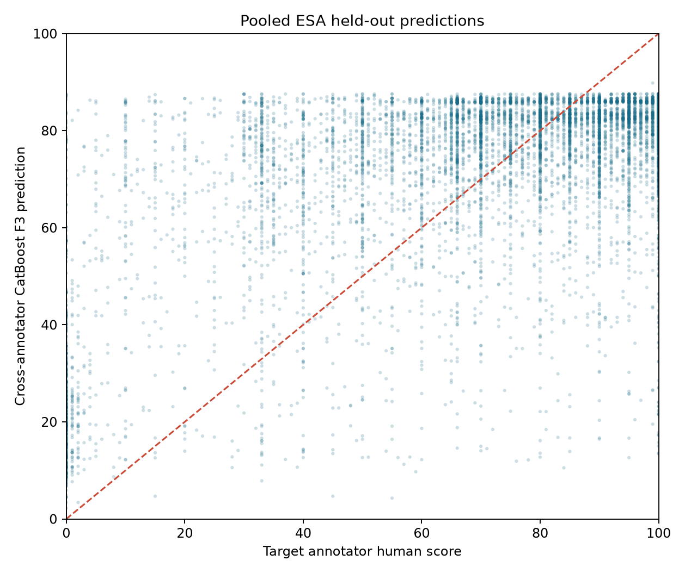
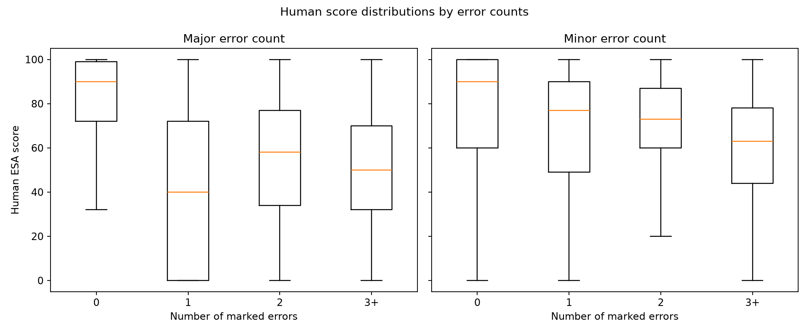
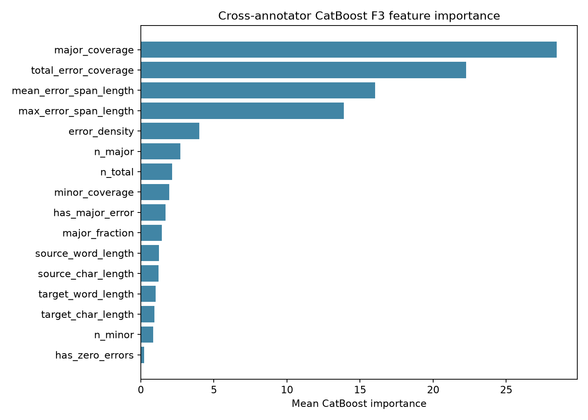

# Experiment 2 — Cross-annotator score generalization

## Design and data

This experiment reuses the cleaned WMT25 ESA annotation table and Experiment 1 document assignments. No Experiment 1 model run was repeated. Each translation is identified by a SHA-256-derived key over language pair, full segment `doc_id`, and translation system. Repeated rows from one annotator on one translation are collapsed to a single annotator view: score averaged, error features taken from the deterministically earliest annotation. Only distinct annotators form a human pair. Every unordered annotator pair contributes both directed views; each translation's directed weights sum to 1, so translations with more annotators are not given more total evaluation/training weight.

The frozen model is trained on input annotations and their own annotator scores; it is evaluated against both the input annotator score and the independent target annotator score. The cross-trained model is trained on input features from annotator A and the score from annotator B. Both use the same document-level outer assignments, same held-out directed pairs, F1/F2/F3, and no annotator/system/document IDs as numeric predictors. Inner validation and all preprocessing/tuning use training documents only. Pooled results use the original grouped train/validation/test split. Bhojpuri results use the original five grouped outer folds. Document, exact-source leakage-group, reciprocal-pair, and translation overlap checks passed: `{"fold_1": {"train_docs": 49, "test_docs": 1}, "fold_2": {"train_docs": 40, "test_docs": 10}, "fold_3": {"train_docs": 37, "test_docs": 13}, "fold_4": {"train_docs": 38, "test_docs": 12}, "fold_5": {"train_docs": 36, "test_docs": 14}, "pooled": {"train": 560, "validation": 119, "test": 149}}`.

The saved Bho fold assignment has held-out document counts {'fold_1': 1, 'fold_2': 10, 'fold_3': 13, 'fold_4': 12, 'fold_5': 14}; one fold contains fewer than five documents, so fold-level uncertainty is uneven. The old assignments were retained to match Experiment 1; no held-out document was reassigned to improve the balance.

The paired set has **33,049 translations** and **66,098 directed input-target rows** across **878 document groups**, **47 systems**, and **14 ESA language pairs**. Metrics are pair-weighted so each translation sums to one. Confidence intervals resample document groups. Human disagreement is descriptive and uses the same weights. The `input_annotator_a` row is a human-to-human reference: A's score predicts independent annotator B's score.

### Paired annotation population by language pair

| language_pair | translations | documents | systems | annotators | count | mean | std | median |
| --- | --- | --- | --- | --- | --- | --- | --- | --- |
| cs-de_DE | 3181.000 | 128.000 | 21.000 | 12.000 | 6362.000 | 83.566 | 20.050 | 90.000 |
| cs-uk_UA | 2798.000 | 131.000 | 19.000 | 7.000 | 5596.000 | 87.645 | 15.656 | 94.000 |
| en-ar_EG | 1478.000 | 51.000 | 19.000 | 3.000 | 2956.000 | 32.313 | 37.979 | 1.000 |
| en-bho_IN | 2300.000 | 50.000 | 19.000 | 4.000 | 4600.000 | 70.550 | 30.155 | 82.000 |
| en-cs_CZ | 2864.000 | 59.000 | 20.000 | 17.000 | 5728.000 | 78.813 | 19.083 | 84.000 |
| en-et_EE | 2867.000 | 52.000 | 19.000 | 8.000 | 5734.000 | 58.391 | 25.644 | 60.000 |
| en-is_IS | 2451.000 | 53.000 | 19.000 | 5.000 | 4902.000 | 46.100 | 29.856 | 47.000 |
| en-it_IT | 2893.000 | 54.000 | 18.000 | 7.000 | 5786.000 | 70.652 | 26.580 | 72.000 |
| en-ja_JP | 3018.000 | 51.000 | 19.000 | 40.000 | 6036.000 | 81.174 | 19.870 | 86.000 |
| en-mas_KE | 709.000 | 47.000 | 19.000 | 4.000 | 1418.000 | 1.928 | 7.156 | 0.000 |
| en-ru_RU | 1942.000 | 50.000 | 19.000 | 6.000 | 3884.000 | 72.938 | 25.194 | 79.000 |
| en-sr_Cyrl_RS | 2068.000 | 50.000 | 19.000 | 4.000 | 4136.000 | 79.436 | 24.075 | 90.000 |
| en-uk_UA | 1541.000 | 51.000 | 19.000 | 2.000 | 3082.000 | 87.374 | 9.849 | 90.000 |
| en-zh_CN | 2939.000 | 51.000 | 19.000 | 39.000 | 5878.000 | 84.797 | 18.215 | 90.000 |

## Cross-annotator prediction metrics

`same` rows measure same-annotator targets; `frozen_cross` measures transfer from A's errors to B's score using the same-annotator model; `cross_trained` trains directly on A-features/B-score pairs. MAE/RMSE, median absolute error, correlation, bias and ±10 accuracy are weighted by translation. The confidence interval columns are document-cluster bootstrap intervals for MAE.

### English→Bhojpuri grouped out-of-fold results

| regime | model | feature_set | n_translations | mae | mae_ci_low | mae_ci_high | rmse | median_absolute_error | pearson | spearman | mean_bias_pred_minus_human | within_10_pct |
| --- | --- | --- | --- | --- | --- | --- | --- | --- | --- | --- | --- | --- |
| same_target | mean | none | 2300.000 | 24.908 | 24.000 | 26.224 | 30.189 | 23.437 | -0.070 | -0.038 | 0.028 | 16.522 |
| cross_trained | mean | none | 2300.000 | 24.908 | 24.000 | 26.253 | 30.189 | 23.437 | -0.070 | -0.038 | 0.028 | 16.522 |
| same_target | fixed_penalty | none | 2300.000 | 22.251 | 20.095 | 24.040 | 35.384 | 10.000 | 0.275 | 0.562 | 19.432 | 51.304 |
| frozen_cross | fixed_penalty | none | 2300.000 | 24.949 | 23.271 | 27.120 | 36.751 | 14.000 | 0.160 | 0.282 | 19.432 | 43.196 |
| same_target | ridge | F1 | 2300.000 | 23.468 | 22.131 | 24.783 | 29.293 | 21.062 | 0.237 | 0.480 | 0.199 | 17.522 |
| frozen_cross | ridge | F1 | 2300.000 | 24.205 | 23.141 | 25.902 | 30.056 | 21.500 | 0.133 | 0.217 | 0.199 | 17.913 |
| cross_trained | ridge | F1 | 2300.000 | 24.471 | 23.492 | 25.854 | 29.804 | 22.631 | 0.156 | 0.205 | 0.105 | 16.957 |
| same_target | ridge | F2 | 2300.000 | 12.733 | 11.383 | 13.691 | 16.548 | 9.381 | 0.836 | 0.824 | 0.334 | 54.283 |
| frozen_cross | ridge | F2 | 2300.000 | 18.421 | 16.600 | 19.686 | 24.630 | 13.758 | 0.611 | 0.482 | 0.334 | 39.130 |
| cross_trained | ridge | F2 | 2300.000 | 18.976 | 17.236 | 19.992 | 23.600 | 16.478 | 0.622 | 0.481 | 0.156 | 25.435 |
| same_target | ridge | F3 | 2300.000 | 12.267 | 10.937 | 13.221 | 16.249 | 10.394 | 0.843 | 0.825 | 0.375 | 48.370 |
| frozen_cross | ridge | F3 | 2300.000 | 18.650 | 17.041 | 19.778 | 24.723 | 15.108 | 0.611 | 0.487 | 0.375 | 36.696 |
| cross_trained | ridge | F3 | 2300.000 | 18.862 | 17.314 | 19.968 | 23.366 | 16.230 | 0.632 | 0.490 | -0.038 | 26.130 |
| same_target | catboost | F1 | 2300.000 | 19.201 | 17.741 | 20.377 | 25.251 | 16.353 | 0.547 | 0.607 | 0.310 | 34.130 |
| frozen_cross | catboost | F1 | 2300.000 | 22.841 | 21.954 | 23.874 | 28.483 | 20.486 | 0.376 | 0.344 | 0.310 | 26.174 |
| cross_trained | catboost | F1 | 2300.000 | 22.661 | 21.822 | 23.605 | 27.778 | 19.285 | 0.389 | 0.330 | 0.277 | 21.391 |
| same_target | catboost | F2 | 2300.000 | 11.126 | 9.827 | 11.988 | 15.405 | 8.162 | 0.860 | 0.839 | 0.247 | 57.761 |
| frozen_cross | catboost | F2 | 2300.000 | 19.369 | 17.429 | 20.735 | 25.920 | 15.329 | 0.581 | 0.463 | 0.247 | 37.326 |
| cross_trained | catboost | F2 | 2300.000 | 18.797 | 17.218 | 19.760 | 23.490 | 15.584 | 0.627 | 0.481 | 0.166 | 26.935 |
| same_target | catboost | F3 | 2300.000 | 10.707 | 9.405 | 11.616 | 15.184 | 7.511 | 0.864 | 0.849 | 0.527 | 60.196 |
| frozen_cross | catboost | F3 | 2300.000 | 19.372 | 17.561 | 20.785 | 25.906 | 15.294 | 0.580 | 0.455 | 0.527 | 37.543 |
| cross_trained | catboost | F3 | 2300.000 | 18.723 | 17.310 | 19.739 | 23.263 | 15.691 | 0.637 | 0.488 | 0.243 | 26.804 |
| human_baseline | input_annotator_a | human_score_a | 2300.000 | 22.704 | 20.098 | 24.823 | 30.445 | 18.000 | 0.490 | 0.387 | 0.000 | 37.826 |

### Pooled ESA held-out results

| regime | model | feature_set | n_translations | mae | mae_ci_low | mae_ci_high | rmse | median_absolute_error | pearson | spearman | mean_bias_pred_minus_human | within_10_pct |
| --- | --- | --- | --- | --- | --- | --- | --- | --- | --- | --- | --- | --- |
| same_target | mean | none | 4294.000 | 23.873 | 21.800 | 26.370 | 30.151 | 21.627 |  |  | 1.427 | 24.872 |
| cross_trained | mean | none | 4294.000 | 23.873 | 21.703 | 26.756 | 30.151 | 21.627 |  |  | 1.427 | 24.872 |
| same_target | fixed_penalty | none | 4294.000 | 25.229 | 21.763 | 29.307 | 37.425 | 16.000 | 0.365 | 0.685 | 24.732 | 41.546 |
| frozen_cross | fixed_penalty | none | 4294.000 | 26.841 | 23.537 | 30.729 | 38.674 | 18.000 | 0.196 | 0.326 | 24.732 | 38.915 |
| same_target | ridge | F1 | 4294.000 | 20.900 | 18.667 | 23.603 | 28.051 | 17.070 | 0.370 | 0.664 | 2.045 | 28.062 |
| frozen_cross | ridge | F1 | 4294.000 | 22.902 | 20.749 | 25.702 | 30.096 | 18.831 | 0.188 | 0.309 | 2.045 | 26.141 |
| cross_trained | ridge | F1 | 4294.000 | 23.084 | 20.923 | 25.908 | 29.684 | 20.412 | 0.180 | 0.308 | 1.699 | 26.164 |
| same_target | ridge | F2 | 4294.000 | 13.324 | 12.419 | 14.347 | 17.951 | 11.737 | 0.803 | 0.791 | 0.452 | 44.108 |
| frozen_cross | ridge | F2 | 4294.000 | 18.099 | 16.964 | 19.299 | 24.235 | 12.073 | 0.622 | 0.460 | 0.452 | 36.563 |
| cross_trained | ridge | F2 | 4294.000 | 18.573 | 17.658 | 19.589 | 23.422 | 16.625 | 0.629 | 0.458 | 0.366 | 28.225 |
| same_target | ridge | F3 | 4294.000 | 12.217 | 11.306 | 13.295 | 16.811 | 8.280 | 0.830 | 0.783 | 0.554 | 57.708 |
| frozen_cross | ridge | F3 | 4294.000 | 18.643 | 17.512 | 19.782 | 24.825 | 14.000 | 0.613 | 0.452 | 0.554 | 40.265 |
| cross_trained | ridge | F3 | 4294.000 | 18.476 | 17.564 | 19.503 | 23.308 | 15.570 | 0.634 | 0.456 | 0.441 | 29.052 |
| same_target | catboost | F1 | 4294.000 | 16.654 | 14.887 | 18.747 | 22.753 | 10.795 | 0.657 | 0.707 | 1.600 | 47.881 |
| frozen_cross | catboost | F1 | 4294.000 | 21.796 | 20.216 | 23.667 | 28.352 | 17.794 | 0.413 | 0.367 | 1.600 | 35.864 |
| cross_trained | catboost | F1 | 4294.000 | 21.536 | 19.868 | 23.384 | 27.294 | 16.260 | 0.428 | 0.371 | 1.422 | 27.038 |
| same_target | catboost | F2 | 4294.000 | 11.687 | 10.878 | 12.681 | 16.060 | 7.570 | 0.847 | 0.807 | 0.517 | 57.720 |
| frozen_cross | catboost | F2 | 4294.000 | 18.326 | 17.230 | 19.393 | 24.741 | 13.407 | 0.624 | 0.463 | 0.517 | 40.592 |
| cross_trained | catboost | F2 | 4294.000 | 18.083 | 17.187 | 19.155 | 22.957 | 15.653 | 0.648 | 0.467 | 0.475 | 30.484 |
| same_target | catboost | F3 | 4294.000 | 11.708 | 10.931 | 12.653 | 16.023 | 8.151 | 0.848 | 0.799 | 1.240 | 57.592 |
| frozen_cross | catboost | F3 | 4294.000 | 18.457 | 17.335 | 19.512 | 24.807 | 13.588 | 0.620 | 0.458 | 1.240 | 39.939 |
| cross_trained | catboost | F3 | 4294.000 | 18.123 | 17.199 | 19.043 | 23.111 | 14.442 | 0.643 | 0.461 | 1.458 | 30.170 |
| human_baseline | input_annotator_a | human_score_a | 4294.000 | 17.887 | 16.661 | 19.142 | 24.748 | 14.000 | 0.662 | 0.488 | 0.000 | 43.875 |

## Generalization gap and feature ablation

The frozen generalization gap is cross-target MAE minus same-target MAE for a model trained on same-annotator data. A positive value means independent annotator targets are harder. `cross_trained` rows are the directly trained A→B alternative.

| experiment_scope | model | feature_set | same_target_mae | frozen_cross_target_mae | frozen_generalization_gap | gap_ci_low | gap_ci_high | cross_trained_target_mae |
| --- | --- | --- | --- | --- | --- | --- | --- | --- |
| en_bho_cv | ridge | F1 | 23.468 | 24.205 | 0.737 | 0.070 | 1.596 | 24.471 |
| en_bho_cv | ridge | F2 | 12.733 | 18.421 | 5.688 | 4.927 | 6.397 | 18.976 |
| en_bho_cv | ridge | F3 | 12.267 | 18.650 | 6.383 | 5.657 | 7.031 | 18.862 |
| en_bho_cv | catboost | F1 | 19.201 | 22.841 | 3.640 | 2.667 | 4.769 | 22.661 |
| en_bho_cv | catboost | F2 | 11.126 | 19.369 | 8.244 | 7.262 | 8.983 | 18.797 |
| en_bho_cv | catboost | F3 | 10.707 | 19.372 | 8.665 | 7.834 | 9.466 | 18.723 |
| pooled_holdout | ridge | F1 | 20.900 | 22.902 | 2.002 | 1.623 | 2.393 | 23.084 |
| pooled_holdout | ridge | F2 | 13.324 | 18.099 | 4.776 | 4.082 | 5.501 | 18.573 |
| pooled_holdout | ridge | F3 | 12.217 | 18.643 | 6.426 | 5.692 | 7.160 | 18.476 |
| pooled_holdout | catboost | F1 | 16.654 | 21.796 | 5.143 | 4.465 | 5.760 | 21.536 |
| pooled_holdout | catboost | F2 | 11.687 | 18.326 | 6.639 | 5.961 | 7.355 | 18.083 |
| pooled_holdout | catboost | F3 | 11.708 | 18.457 | 6.749 | 5.993 | 7.367 | 18.123 |

| experiment_scope | language_pair | regime | model | feature_set | n_translations | mae | rmse | spearman |
| --- | --- | --- | --- | --- | --- | --- | --- | --- |
| en_bho_cv | en-bho_IN | same_target | ridge | F1 | 2300.000 | 23.468 | 29.293 | 0.480 |
| en_bho_cv | en-bho_IN | frozen_cross | ridge | F1 | 2300.000 | 24.205 | 30.056 | 0.217 |
| en_bho_cv | en-bho_IN | cross_trained | ridge | F1 | 2300.000 | 24.471 | 29.804 | 0.205 |
| en_bho_cv | en-bho_IN | same_target | ridge | F2 | 2300.000 | 12.733 | 16.548 | 0.824 |
| en_bho_cv | en-bho_IN | frozen_cross | ridge | F2 | 2300.000 | 18.421 | 24.630 | 0.482 |
| en_bho_cv | en-bho_IN | cross_trained | ridge | F2 | 2300.000 | 18.976 | 23.600 | 0.481 |
| en_bho_cv | en-bho_IN | same_target | ridge | F3 | 2300.000 | 12.267 | 16.249 | 0.825 |
| en_bho_cv | en-bho_IN | frozen_cross | ridge | F3 | 2300.000 | 18.650 | 24.723 | 0.487 |
| en_bho_cv | en-bho_IN | cross_trained | ridge | F3 | 2300.000 | 18.862 | 23.366 | 0.490 |
| en_bho_cv | en-bho_IN | same_target | catboost | F1 | 2300.000 | 19.201 | 25.251 | 0.607 |
| en_bho_cv | en-bho_IN | frozen_cross | catboost | F1 | 2300.000 | 22.841 | 28.483 | 0.344 |
| en_bho_cv | en-bho_IN | cross_trained | catboost | F1 | 2300.000 | 22.661 | 27.778 | 0.330 |
| en_bho_cv | en-bho_IN | same_target | catboost | F2 | 2300.000 | 11.126 | 15.405 | 0.839 |
| en_bho_cv | en-bho_IN | frozen_cross | catboost | F2 | 2300.000 | 19.369 | 25.920 | 0.463 |
| en_bho_cv | en-bho_IN | cross_trained | catboost | F2 | 2300.000 | 18.797 | 23.490 | 0.481 |
| en_bho_cv | en-bho_IN | same_target | catboost | F3 | 2300.000 | 10.707 | 15.184 | 0.849 |
| en_bho_cv | en-bho_IN | frozen_cross | catboost | F3 | 2300.000 | 19.372 | 25.906 | 0.455 |
| en_bho_cv | en-bho_IN | cross_trained | catboost | F3 | 2300.000 | 18.723 | 23.263 | 0.488 |
| pooled_holdout | ALL_ESA | same_target | ridge | F1 | 4294.000 | 20.900 | 28.051 | 0.664 |
| pooled_holdout | ALL_ESA | frozen_cross | ridge | F1 | 4294.000 | 22.902 | 30.096 | 0.309 |
| pooled_holdout | ALL_ESA | cross_trained | ridge | F1 | 4294.000 | 23.084 | 29.684 | 0.308 |
| pooled_holdout | ALL_ESA | same_target | ridge | F2 | 4294.000 | 13.324 | 17.951 | 0.791 |
| pooled_holdout | ALL_ESA | frozen_cross | ridge | F2 | 4294.000 | 18.099 | 24.235 | 0.460 |
| pooled_holdout | ALL_ESA | cross_trained | ridge | F2 | 4294.000 | 18.573 | 23.422 | 0.458 |
| pooled_holdout | ALL_ESA | same_target | ridge | F3 | 4294.000 | 12.217 | 16.811 | 0.783 |
| pooled_holdout | ALL_ESA | frozen_cross | ridge | F3 | 4294.000 | 18.643 | 24.825 | 0.452 |
| pooled_holdout | ALL_ESA | cross_trained | ridge | F3 | 4294.000 | 18.476 | 23.308 | 0.456 |
| pooled_holdout | ALL_ESA | same_target | catboost | F1 | 4294.000 | 16.654 | 22.753 | 0.707 |
| pooled_holdout | ALL_ESA | frozen_cross | catboost | F1 | 4294.000 | 21.796 | 28.352 | 0.367 |
| pooled_holdout | ALL_ESA | cross_trained | catboost | F1 | 4294.000 | 21.536 | 27.294 | 0.371 |
| pooled_holdout | ALL_ESA | same_target | catboost | F2 | 4294.000 | 11.687 | 16.060 | 0.807 |
| pooled_holdout | ALL_ESA | frozen_cross | catboost | F2 | 4294.000 | 18.326 | 24.741 | 0.463 |
| pooled_holdout | ALL_ESA | cross_trained | catboost | F2 | 4294.000 | 18.083 | 22.957 | 0.467 |
| pooled_holdout | ALL_ESA | same_target | catboost | F3 | 4294.000 | 11.708 | 16.023 | 0.799 |
| pooled_holdout | ALL_ESA | frozen_cross | catboost | F3 | 4294.000 | 18.457 | 24.807 | 0.458 |
| pooled_holdout | ALL_ESA | cross_trained | catboost | F3 | 4294.000 | 18.123 | 23.111 | 0.461 |

### Pooled cross-trained F3 performance by language pair

| language_pair | model | n_translations | n_unique_documents | mae | mae_ci_low | mae_ci_high | rmse | spearman |
| --- | --- | --- | --- | --- | --- | --- | --- | --- |
| cs-de_DE | ridge | 382.000 | 19.000 | 18.172 | 16.579 | 20.308 | 21.744 | 0.212 |
| cs-de_DE | catboost | 382.000 | 19.000 | 17.867 | 16.494 | 19.717 | 21.510 | 0.225 |
| cs-uk_UA | ridge | 298.000 | 19.000 | 14.298 | 13.568 | 15.194 | 16.715 | 0.376 |
| cs-uk_UA | catboost | 298.000 | 19.000 | 14.318 | 13.483 | 15.132 | 16.647 | 0.366 |
| en-ar_EG | ridge | 235.000 | 10.000 | 22.787 | 19.971 | 24.570 | 25.578 | 0.766 |
| en-ar_EG | catboost | 235.000 | 10.000 | 20.566 | 18.678 | 22.361 | 24.946 | 0.673 |
| en-cs_CZ | ridge | 617.000 | 14.000 | 15.464 | 14.657 | 16.414 | 19.502 | 0.141 |
| en-cs_CZ | catboost | 617.000 | 14.000 | 14.949 | 13.883 | 15.849 | 19.058 | 0.176 |
| en-et_EE | ridge | 452.000 | 10.000 | 21.809 | 19.308 | 24.609 | 27.664 | 0.280 |
| en-et_EE | catboost | 452.000 | 10.000 | 21.614 | 19.286 | 24.241 | 27.389 | 0.285 |
| en-is_IS | ridge | 348.000 | 10.000 | 21.397 | 20.009 | 22.525 | 26.939 | 0.512 |
| en-is_IS | catboost | 348.000 | 10.000 | 22.417 | 21.179 | 23.375 | 28.294 | 0.511 |
| en-it_IT | ridge | 338.000 | 10.000 | 20.346 | 18.826 | 22.459 | 25.481 | 0.220 |
| en-it_IT | catboost | 338.000 | 10.000 | 20.393 | 18.798 | 22.903 | 25.782 | 0.230 |
| en-ja_JP | ridge | 427.000 | 9.000 | 15.255 | 14.735 | 15.587 | 19.246 | 0.006 |
| en-ja_JP | catboost | 427.000 | 9.000 | 14.897 | 14.464 | 15.250 | 18.834 | 0.006 |
| en-mas_KE | ridge | 128.000 | 10.000 | 21.761 | 19.882 | 22.695 | 22.970 | 0.073 |
| en-mas_KE | catboost | 128.000 | 10.000 | 23.052 | 19.980 | 25.532 | 26.105 | -0.001 |
| en-ru_RU | ridge | 267.000 | 10.000 | 19.235 | 17.166 | 22.832 | 23.754 | 0.360 |
| en-ru_RU | catboost | 267.000 | 10.000 | 19.016 | 16.813 | 23.013 | 23.629 | 0.375 |
| en-sr_Cyrl_RS | ridge | 286.000 | 9.000 | 26.575 | 23.943 | 29.423 | 33.532 | 0.166 |
| en-sr_Cyrl_RS | catboost | 286.000 | 9.000 | 24.515 | 23.040 | 26.231 | 30.894 | 0.175 |
| en-uk_UA | ridge | 233.000 | 10.000 | 10.272 | 9.343 | 11.098 | 11.781 | 0.297 |
| en-uk_UA | catboost | 233.000 | 10.000 | 9.784 | 9.307 | 10.317 | 11.393 | 0.326 |
| en-zh_CN | ridge | 283.000 | 9.000 | 16.357 | 15.276 | 18.895 | 21.617 | 0.083 |
| en-zh_CN | catboost | 283.000 | 9.000 | 15.997 | 15.011 | 18.063 | 21.471 | 0.086 |
| cs-de_DE | input_annotator_a | 382.000 | 19.000 | 16.613 | 14.092 | 19.438 | 24.178 | 0.232 |
| cs-uk_UA | input_annotator_a | 298.000 | 19.000 | 14.154 | 12.255 | 15.922 | 18.928 | 0.223 |
| en-ar_EG | input_annotator_a | 235.000 | 10.000 | 7.204 | 5.143 | 11.482 | 17.984 | 0.702 |
| en-cs_CZ | input_annotator_a | 617.000 | 14.000 | 17.280 | 15.589 | 18.690 | 22.632 | 0.241 |
| en-et_EE | input_annotator_a | 452.000 | 10.000 | 22.308 | 19.125 | 26.285 | 28.229 | 0.357 |
| en-is_IS | input_annotator_a | 348.000 | 10.000 | 19.187 | 17.462 | 21.428 | 23.874 | 0.601 |
| en-it_IT | input_annotator_a | 338.000 | 10.000 | 25.550 | 22.737 | 28.933 | 32.513 | 0.175 |
| en-ja_JP | input_annotator_a | 427.000 | 9.000 | 20.077 | 17.641 | 21.109 | 26.438 | -0.062 |
| en-mas_KE | input_annotator_a | 128.000 | 10.000 | 4.789 | 2.754 | 7.941 | 13.073 | 0.249 |
| en-ru_RU | input_annotator_a | 267.000 | 10.000 | 21.363 | 19.274 | 24.975 | 27.675 | 0.394 |
| en-sr_Cyrl_RS | input_annotator_a | 286.000 | 9.000 | 19.455 | 16.772 | 22.619 | 25.513 | 0.089 |
| en-uk_UA | input_annotator_a | 233.000 | 10.000 | 8.262 | 7.308 | 9.885 | 11.131 | 0.328 |
| en-zh_CN | input_annotator_a | 283.000 | 9.000 | 21.594 | 20.270 | 25.028 | 29.842 | -0.026 |

## Human annotator disagreement

| language_pair | translations | independent_annotator_pairs | weighted_mean_abs_difference | weighted_median_abs_difference | weighted_p90_abs_difference |
| --- | --- | --- | --- | --- | --- |
| ALL_ESA | 33049.000 | 33049.000 | 18.343 | 13.000 | 43.000 |
| cs-de_DE | 3181.000 | 3181.000 | 17.397 | 12.000 | 40.000 |
| cs-uk_UA | 2798.000 | 2798.000 | 13.175 | 10.000 | 32.000 |
| en-ar_EG | 1478.000 | 1478.000 | 8.766 | 1.000 | 25.000 |
| en-bho_IN | 2300.000 | 2300.000 | 22.704 | 18.000 | 51.000 |
| en-cs_CZ | 2864.000 | 2864.000 | 17.643 | 14.000 | 39.000 |
| en-et_EE | 2867.000 | 2867.000 | 21.180 | 17.000 | 45.000 |
| en-is_IS | 2451.000 | 2451.000 | 19.229 | 16.000 | 40.000 |
| en-it_IT | 2893.000 | 2893.000 | 26.215 | 23.000 | 57.000 |
| en-ja_JP | 3018.000 | 3018.000 | 19.653 | 15.000 | 40.000 |
| en-mas_KE | 709.000 | 709.000 | 3.365 | 0.000 | 7.000 |
| en-ru_RU | 1942.000 | 1942.000 | 22.579 | 18.000 | 51.000 |
| en-sr_Cyrl_RS | 2068.000 | 2068.000 | 22.865 | 15.000 | 56.000 |
| en-uk_UA | 1541.000 | 1541.000 | 8.690 | 6.000 | 19.000 |
| en-zh_CN | 2939.000 | 2939.000 | 16.467 | 10.000 | 40.000 |

These human-to-human differences compare two raters on the same translation. Model MAE compares a prediction with one rater. They provide context but are not the same evaluation quantity.

## Difficult and contradictory examples

The failure-case CSV contains the 30 largest pooled held-out CatBoost F3 errors (one row per translation) and eligible low-score/no-error, high-score/major-error, high-disagreement, and A-versus-B residual contrast examples. Each row includes source, translation, both annotators' scores, predicted score, and both span lists. The category counts in this export are: `{'model_close_to_a_far_from_b': 811, 'model_closer_to_b_than_a': 654, 'high_score_with_major_errors': 372, 'high_annotator_disagreement': 252, 'largest_model_error': 11, 'low_score_no_marked_errors': 2}`. These cases make it possible to inspect whether disagreements between free-form score and marked spans account for model residuals.

## Experiment 3 local sample

The independent 100-translation Bhojpuri sample is frozen in `../experiment3/sample100.csv` with seed 42 and a SHA-256 manifest before any hosted model call. It was sampled without using labels, features, or model residuals. The local baseline comparison is in `../experiment3/metrics_local.csv` and uses the same held-out OOF examples. Frontier judging is a separate script and is not implied by these local results.

## Limitations

These experiments use human error annotations as model inputs, so they estimate score prediction conditional on supplied spans, not a complete automatic error-detection pipeline. The paired sample is restricted to translations with at least two valid, distinct annotators; invalid/missing spans were already excluded by Experiment 1. Annotator scores are averaged only when one annotator has repeated rows for a translation. Pooled outcomes combine different language directions and scoring distributions; per-language rows should be read alongside the pooled summary. Stable use after an LLM detector requires evaluation with detector-generated errors and a wider frozen sample.
