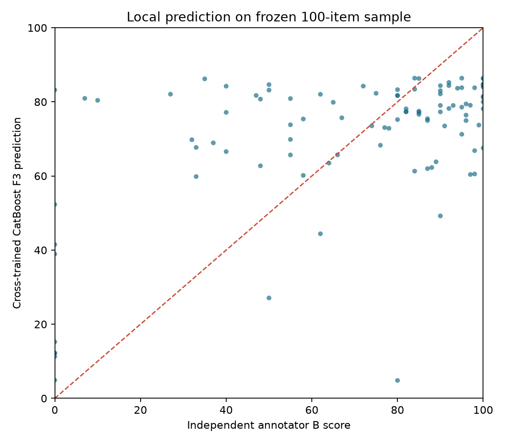
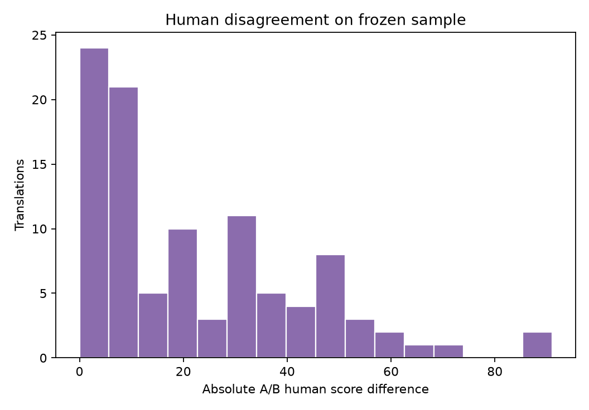

# Experiment 3 — Frontier score judge

## Status

The frozen 100-translation sample and local baselines are complete. The hosted judge was not run on sample items. Three synthetic-only preflight calls ended with status `request_error`, sanitized category `rate_or_quota_limit`, HTTP `429`. Their observed token-price estimate totals **$0.000019**. No source or translation text or human score was sent, and no hosted scores are fabricated. The provider's rate/quota response ended this part of the run.

## Local results against independent annotator B

| model | n_translations | n_documents | mae | mae_ci_low | mae_ci_high | rmse | within_10_pct | delta_mae_vs_matched_catboost | delta_ci_low | delta_ci_high |
| --- | --- | --- | --- | --- | --- | --- | --- | --- | --- | --- |
| mean | 100.000 | 29.000 | 25.418 | 22.368 | 28.555 | 30.972 | 14.000 | 5.327 | 3.025 | 8.538 |
| ridge_cross_F3 | 100.000 | 29.000 | 20.350 | 16.515 | 24.392 | 26.198 | 28.000 | 0.259 | -0.546 | 1.089 |
| catboost_cross_F3 | 100.000 | 29.000 | 20.091 | 16.311 | 23.723 | 26.269 | 29.000 | 0.000 | 0.000 | 0.000 |
| catboost_same_F3 | 100.000 | 29.000 | 21.988 | 17.843 | 25.283 | 30.432 | 40.000 | 1.897 | -0.106 | 3.700 |
| human_input_annotator_a | 100.000 | 29.000 | 22.500 | 19.362 | 25.720 | 30.551 | 41.000 | 2.409 | -0.729 | 5.911 |

## Secondary local results against input annotator A

| model | n_translations | n_documents | mae | mae_ci_low | mae_ci_high | rmse | within_10_pct | delta_mae_vs_matched_catboost | delta_ci_low | delta_ci_high |
| --- | --- | --- | --- | --- | --- | --- | --- | --- | --- | --- |
| mean | 100.000 | 29.000 | 24.299 | 20.392 | 29.105 | 29.668 | 20.000 | 14.323 | 10.294 | 19.727 |
| ridge_cross_F3 | 100.000 | 29.000 | 14.801 | 12.599 | 17.242 | 16.777 | 25.000 | 4.826 | 3.310 | 6.491 |
| catboost_cross_F3 | 100.000 | 29.000 | 16.085 | 14.175 | 18.298 | 18.225 | 18.000 | 6.109 | 4.565 | 7.818 |
| catboost_same_F3 | 100.000 | 29.000 | 9.975 | 8.137 | 11.431 | 14.024 | 62.000 | 0.000 | 0.000 | 0.000 |

On the same sample, A/B absolute score disagreement has mean 22.50, median 17.50, and p90 50.10. Human disagreement and model-to-rater error are different quantities; the comparison is descriptive rather than an equivalence claim.

## Residual inspection

Among the 10% most disagreeing A/B cases (n=10), mean absolute CatBoost error against B is 52.52, compared with 20.09 overall. Annotator B marked at least one major error while assigning a score of 80 or more in 22 cases; their mean model error is 16.58. There are 0 cases with B score 50 or lower and no B-marked errors. Across the full sample, the prediction is closer to A than B in 46 cases, closer to B in 44, and tied in 10. This is consistent with annotator disagreement contributing to large residuals, but the small sample does not establish causation.

`failure_cases.csv` distinguishes errors marked by the input annotator A from B's own error spans. Cases with a low score and no errors, or a high score with major errors, are selected using the same annotator's score and span list wherever possible. A/B score contradictions remain separate cross-annotator cases.

## Review artifacts

- `sample100.csv` and `sample100_manifest.json`: frozen sample IDs and digest.
- `prompts/feature_only.jsonl` and `prompts/context_aware.jsonl`: exact prompt payloads with response schemas. Join IDs are outside the message bodies; scores and annotator/system identifiers are excluded from prompts.
- `llm_predictions.csv` and `comparison.csv`: explicit `not_run_preflight_blocked` rows with blank hosted score fields.
- `metrics.csv` and `paired_bootstrap.csv`: local results plus explicit unavailable hosted comparisons.
- `failure_cases.csv`: largest local CatBoost errors, high human disagreement, contradictory score/error cases, and cases where predictions track A versus B.
- `api_costs.csv`: sanitized synthetic preflight usage and request status.
- `plots/local_predicted_vs_human.png` and `plots/human_disagreement.png`.

See `metrics_local.csv` and `sample100_local_baselines.csv` for per-example local predictions and document-bootstrap intervals.
