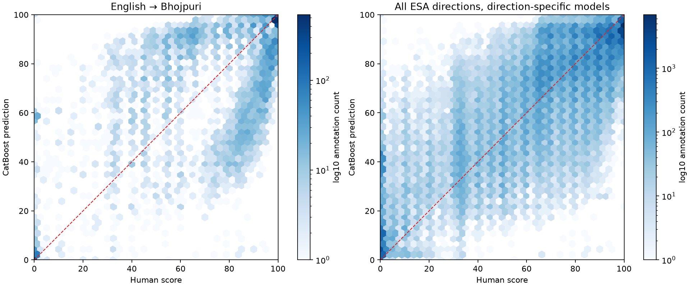
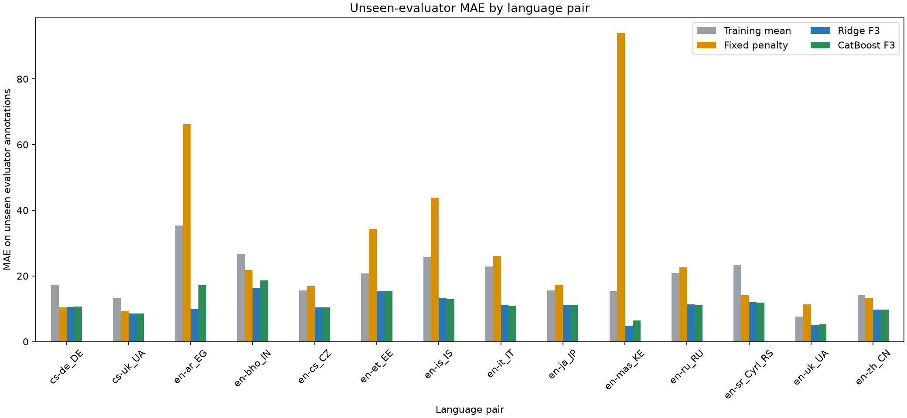
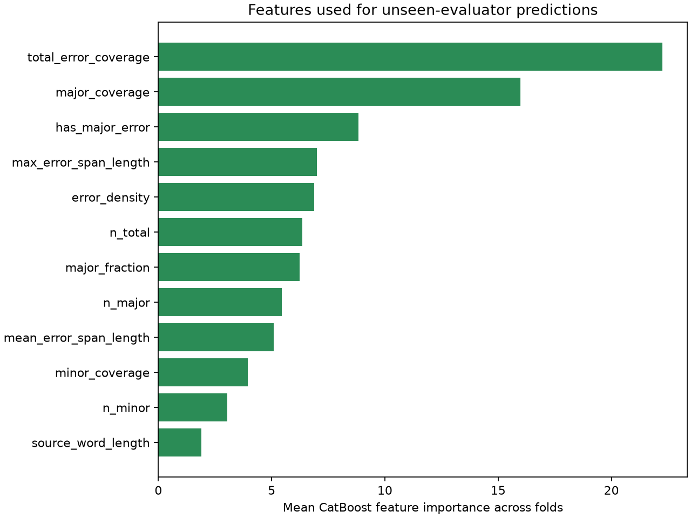

# Can an error-to-score model generalize to unseen human evaluators?

## Answer

**Yes, within a language pair and when given the new evaluator’s own error annotations, a small numeric model can predict that evaluator’s score without having seen any of their scores or annotation rows during training or tuning.** Ridge F3 was strongest overall. CatBoost F3 also improved substantially over simple baselines, but it did not beat Ridge in the pooled or English→Bhojpuri test. This is evidence for a reusable error-to-score relationship within a direction, not proof that one universal scorer works across languages or that a scorer will work on automatically detected errors.

## Test design

This is a new, isolated follow-up to the earlier annotator-pair experiment. That earlier test used annotator A’s features to predict annotator B’s score. Here, the held-out evaluator supplies the error annotation features at inference, and the model predicts that evaluator’s own score; the evaluator’s score and all of their rows are absent from fitting and model selection.

- The source is the already prepared, validated WMT25 ESA annotation table: 99,846 rows across 14 ESA language pairs. **48 rows labelled `unknown` for annotator were excluded** because they cannot be assigned to an identifiable evaluator. The scored population is 99,798 rows, 884 source documents, and 157 identifiable `(language pair, annotator ID)` evaluators. The annotator IDs are anonymized WMT identifiers.
- A separate direction-specific scorer was trained for each language pair. This controls for direction-specific human-score scales; it does **not** test one universal cross-language model.
- In each language pair, evaluator IDs were split into up to five folds. Each evaluator fold was held out in turn. Documents were separately split into five folds, grouping together exact-source leakage groups from the existing split manifest. For each fitted model, roughly 65% of documents were used for training, 15% for validation, and 20% for test. Each identifiable annotation received exactly one out-of-fold test prediction.
- Training used only training-document records from evaluators outside the held-out evaluator fold. Validation used only validation-document records from those same seen evaluators, and a validation evaluator had to also occur in training. Test predictions were made only on held-out-document records from held-out evaluators. Therefore neither test evaluator IDs nor test documents/leakage groups entered training or tuning.
- The model input was the requested numeric F3 feature set. No annotator ID, system name, document ID, source/translation text, or human score was a predictor. At inference, the new evaluator’s error features are available; the evaluator’s identity and score are not.
- Training and validation gave each seen evaluator equal total weight, so a high-volume rater could not dominate the scoring function. The reported micro MAE weights each test annotation equally; macro evaluator MAE averages each held-out evaluator equally.

### Models

| Model | Definition |
|---|---|
| Mean | Training-set evaluator-balanced mean score. |
| Fixed penalty | `clip(100 − 5 × n_major − n_minor, 0, 100)`; a heuristic comparator. |
| Ridge F3 | Training-weighted `StandardScaler` + Ridge; alpha chosen from 0.1, 1, 10, 100 by evaluator-balanced validation MAE. |
| CatBoost F3 | 500 iterations maximum, depth 4, learning rate 0.03, L2 3, RMSE; early stopping on validation RMSE with patience 60. |

Ridge preprocessing was fitted only on each training partition. CatBoost settings were fixed; early stopping used validation only. Predictions were clipped to [0, 100]. The run completed **305 fit/evaluation folds**. Assertions in the run script checked evaluator isolation, source-group/document isolation, and one prediction per retained annotation.

## Main results

The pooled row metrics combine outputs from the separate direction-specific models and weight each annotation equally. Macro evaluator MAE gives each evaluator equal weight.

| Evaluation scope | Model | Test annotations | Unseen evaluators | Micro MAE | RMSE | Pearson | Spearman | Macro evaluator MAE |
|---|---|---:|---:|---:|---:|---:|---:|---:|
| All 14 ESA directions | Training mean | 99,798 | 157 | 19.608 | 24.383 | 0.677 | 0.492 | 17.628 |
| All 14 ESA directions | Fixed penalty | 99,798 | 157 | 27.731 | 41.519 | 0.307 | 0.646 | 20.107 |
| All 14 ESA directions | **Ridge F3** | **99,798** | **157** | **10.725** | **14.757** | **0.895** | **0.839** | **11.313** |
| All 14 ESA directions | CatBoost F3 | 99,798 | 157 | 11.464 | 15.710 | 0.880 | 0.833 | 11.352 |
| English→Bhojpuri | Training mean | 6,698 | 4 | 26.607 | 32.283 | −0.340 | −0.403 | 28.046 |
| English→Bhojpuri | Fixed penalty | 6,698 | 4 | 21.840 | 35.721 | 0.259 | 0.553 | 20.738 |
| English→Bhojpuri | **Ridge F3** | **6,698** | **4** | **16.353** | **21.227** | **0.738** | **0.651** | **15.048** |
| English→Bhojpuri | CatBoost F3 | 6,698 | 4 | 18.618 | 24.114 | 0.677 | 0.629 | 16.909 |

The Bhojpuri per-evaluator results show that transfer was uneven but not confined to one held-out rater:

| Held-out evaluator | Ridge F3 MAE | CatBoost F3 MAE |
|---|---:|---:|
| en-bho annotator 1 | 23.09 | 24.54 |
| en-bho annotator 2 | 11.49 | 12.80 |
| en-bho annotator 3 | 17.25 | 20.63 |
| en-bho annotator 4 | 8.36 | 9.66 |

### Uncertainty on paired MAE differences

Positive CatBoost-minus-reference MAE means CatBoost is worse. Document-bootstrap intervals resample exact-source leakage groups; macro evaluator intervals resample evaluator IDs within each language pair.

| Scope / comparison | Difference in micro MAE (95% document CI) | Difference in macro evaluator MAE (95% evaluator CI) |
|---|---:|---:|
| All ESA: CatBoost − Ridge | +0.761 (0.554, 0.968) | +0.039 (−0.148, 0.214) |
| All ESA: CatBoost − mean | −8.145 (−9.080, −7.207) | −6.276 (−6.955, −5.603) |
| All ESA: CatBoost − fixed penalty | −16.267 (−19.012, −13.104) | −8.755 (−10.010, −7.494) |
| Bho: CatBoost − Ridge | +2.265 (1.823, 2.568) | +1.861 (1.306, 2.863) |
| Bho: CatBoost − mean | −7.989 (−9.422, −7.020) | −11.137 (−18.267, −4.645) |
| Bho: CatBoost − fixed penalty | −3.221 (−4.273, −2.147) | −3.829 (−11.578, 3.688) |

Ridge beat CatBoost in aggregate row-weighted MAE. For macro evaluator MAE, the overall Ridge/CatBoost difference was near zero with an interval spanning zero. In Bho, Ridge was better than CatBoost on both measures; the evaluator bootstrap is necessarily uncertain because there are only four identifiable Bho evaluators.

## Results by language pair

Every row below tests previously unseen evaluator IDs and documents. Each scorer was trained only on other evaluators in the same direction.

| Language pair | Test annotations | Unseen evaluators | Mean MAE | Fixed penalty MAE | Ridge F3 MAE | CatBoost F3 MAE |
|---|---:|---:|---:|---:|---:|---:|
| cs-de_DE | 8,655 | 12 | 17.269 | 10.406 | 10.507 | 10.639 |
| cs-uk_UA | 8,425 | 7 | 13.392 | 9.423 | 8.580 | 8.537 |
| en-ar_EG | 7,332 | 3 | 35.381 | 66.240 | 9.932 | 17.233 |
| en-bho_IN | 6,698 | 4 | 26.607 | 21.840 | 16.353 | 18.618 |
| en-cs_CZ | 7,545 | 17 | 15.549 | 16.899 | 10.462 | 10.462 |
| en-et_EE | 6,860 | 8 | 20.733 | 34.243 | 15.438 | 15.458 |
| en-is_IS | 6,978 | 5 | 25.862 | 43.818 | 13.205 | 13.009 |
| en-it_IT | 7,249 | 7 | 22.863 | 26.140 | 11.258 | 10.982 |
| en-ja_JP | 6,691 | 40 | 15.660 | 17.376 | 11.260 | 11.268 |
| en-mas_KE | 6,120 | 3 | 15.408 | 93.896 | 4.800 | 6.389 |
| en-ru_RU | 6,659 | 6 | 20.908 | 22.595 | 11.329 | 11.103 |
| en-sr_Cyrl_RS | 7,061 | 4 | 23.456 | 14.158 | 12.046 | 11.926 |
| en-uk_UA | 6,784 | 2 | 7.702 | 11.407 | 5.143 | 5.216 |
| en-zh_CN | 6,741 | 39 | 14.100 | 13.301 | 9.800 | 9.729 |

CatBoost has lower MAE than Ridge in 6 of 14 directions; Ridge wins in 8. Differences are especially large in en-ar_EG and en-bho_IN. Direction score distributions differ, so per-direction rows matter more than treating the pooled MAE as one universal scale.

## Error patterns and agreement

Average CatBoost feature importance was highest for total error coverage (22.24%), major coverage (15.99%), and the major-error indicator (8.83%). Span coverage remains important when the evaluator who produced the spans was absent from training.

For English→Bhojpuri, human scores from distinct evaluators on the same translation differ by mean 22.70 points (median 18; p90 51). This is not the same metric as model-to-one-evaluator MAE, but it describes the task’s annotation noise.

Some held-out evaluator judgments remain difficult because their score and marked-error features conflict. The largest residuals include Bho scores of 0 with no marked errors (CatBoost predictions near 100), and scores of 90–95 with only one minor error (predictions near 3–6). This indicates the model learned the common relation in other evaluators’ data but cannot infer an unseen evaluator’s unusual scoring convention from error features alone. The [largest-error CSV](largest_catboost_errors.csv) lists identifiers, spans summarized as features, scores, predictions, and residuals; [unseen_evaluator_metrics.csv](unseen_evaluator_metrics.csv) reports performance per held-out evaluator.







## Interpretation and limits

The answer to the test question is **yes, with scope limits**: error features can support a scoring rule that predicts scores from annotators whose scores were never used to fit or tune it, at least for known WMT25 ESA directions. Ridge F3 generalizes best in this run; the small nonlinear CatBoost model does not improve on Ridge. The feature-to-score mapping learned across evaluators is therefore useful, but the evidence does not show a need for nonlinear modeling.

This does not establish performance on a new language pair, a human who uses a different annotation rubric, or errors predicted by an LLM detector. It tests unseen anonymized evaluator IDs in the same ESA directions and uses each unseen evaluator’s own human-marked errors as model input. In particular, Bho has only four identifiable evaluators, and a few held-out raters have score/span patterns that differ sharply from the majority.

## Reproduce and inspect

From the project root:

```powershell
uv run python results/experiment4_unseen_evaluators/run_unseen_evaluator_test.py
uv run python results/experiment4_unseen_evaluators/summarize_results.py
```

- `metrics.csv`: micro and macro results overall and by direction.
- `paired_bootstrap.csv`, `macro_evaluator_bootstrap.csv`: paired document-group and evaluator-group uncertainty summaries.
- `predictions.csv.gz`: one out-of-fold prediction per retained, identifiable annotation.
- `fold_audit.csv`, `evaluator_fold_manifest.csv`, `document_fold_manifest.csv`: split manifests and leakage audit.
- `unseen_evaluator_metrics.csv`, `human_disagreement.csv`, `dataset_summary.csv`: evaluator-level results, agreement, and sample composition.
- `largest_catboost_errors.csv`, `catboost_feature_importance.csv`, `plots/`: error review and figures.
- `run_unseen_evaluator_test.py`, `summarize_results.py`, `run_config.json`: reproducible code and configuration.

All files created for this follow-up are contained in `results/experiment4_unseen_evaluators/`. Existing project reports, data, and models were not changed.
